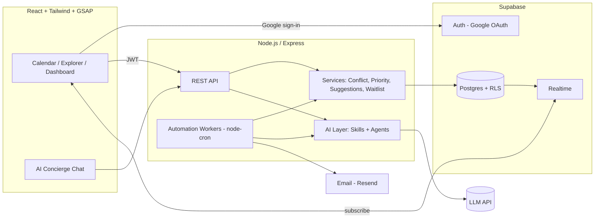
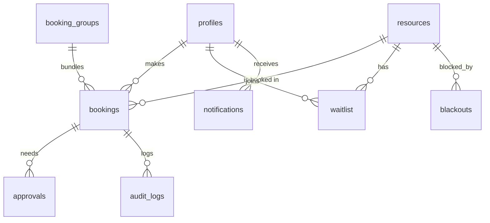
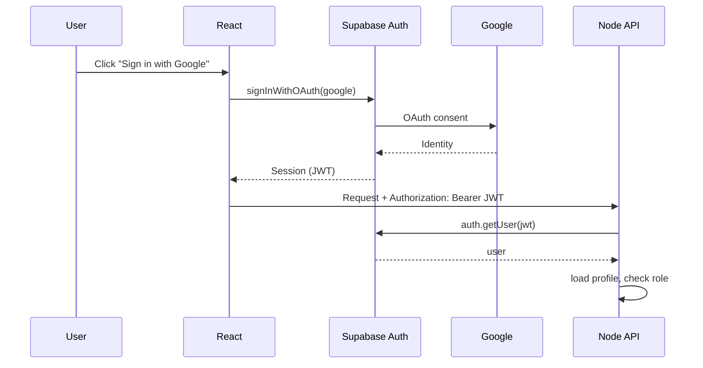
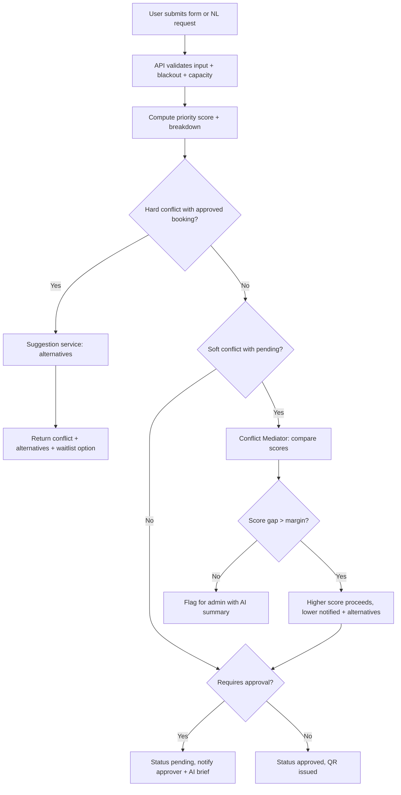
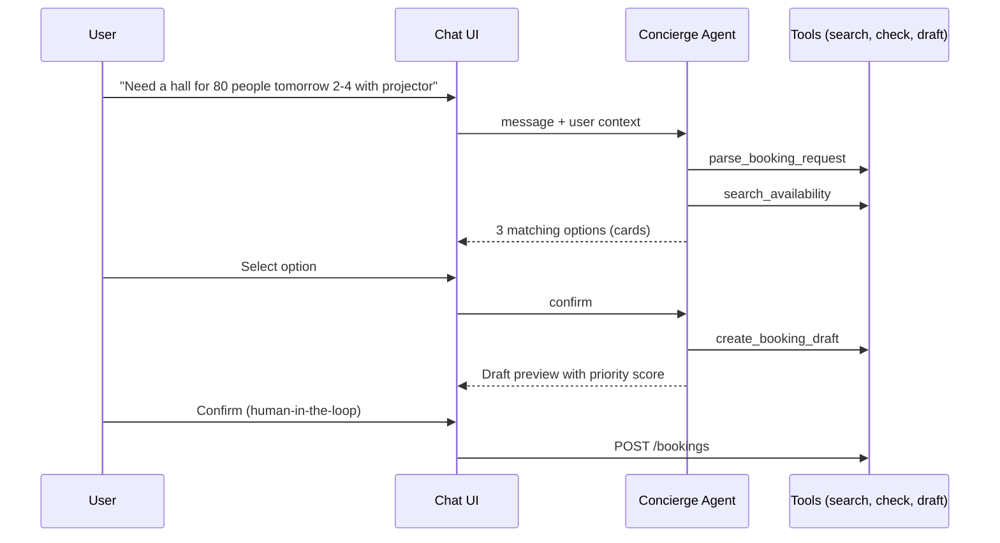

# Architecture.md — Campus Resource Booking & Conflict Resolution

**Stack:** React + Tailwind + GSAP (client) · Node.js/Express (API + workers) · Supabase (Postgres, Auth, Realtime) · Google OAuth · LLM API (Claude, behind a thin wrapper)

---

## 1. Design Principles

1. **The database is the final authority on conflicts.** A Postgres exclusion constraint makes double-booking impossible, even if app code has a bug.
2. **AI advises, code decides.** LLMs parse, explain, summarize and recommend. They never write to the database directly. Every AI output is validated (Zod) and passes through the same services a human request would.
3. **Deterministic first, AI second.** Priority scores, conflict checks, and waitlist order are plain code. AI adds language understanding and explanation on top.
4. **Every AI feature has a non-AI fallback** so the demo never dies on an API timeout.
5. **Clients are read-mostly.** The browser reads via Supabase (RLS + Realtime). All writes go through the Node API using the service-role key.

---

## 2. System Overview



---

## 3. Components

| Component | Responsibility | Tech |
|---|---|---|
| **Web client** | Resource explorer, live calendar, booking form with inline conflict feedback, approvals inbox, AI chat, admin dashboard, GSAP motion | React (Vite), Tailwind, GSAP, FullCalendar, Recharts |
| **Auth** | Google sign-in, session JWT, optional college-domain restriction | Supabase Auth (Google provider) |
| **API server** | Validates JWT, role checks, orchestrates services, exposes REST | Node.js, Express, Zod |
| **Conflict service** | Overlap detection, soft/hard conflict classification, DB-constraint handling | SQL + JS |
| **Priority service** | Transparent scoring with breakdown | JS (deterministic) |
| **Suggestion service** | Alternative slots and rooms, ranked | JS + SQL |
| **Waitlist service** | Join, rank, promote, expire offers | JS |
| **AI layer** | Skills (single-purpose functions) and Agents (tool-using orchestrators) | Anthropic SDK + Zod |
| **Automation workers** | No-show release, waitlist promotion, reminders, escalation, daily digest | node-cron |
| **Notification service** | In-app rows (Realtime) + email | Supabase table + Resend |
| **Realtime** | Push booking changes to all clients | Supabase Realtime on `bookings`, `notifications` |

---

## 4. Data Model



**Key tables** (full SQL in `Build.md`):

| Table | Notes |
|---|---|
| `profiles` | Extends `auth.users`: role (`student/faculty/hod/admin`), department, club, `no_show_count` |
| `resources` | type, location, capacity, `features jsonb`, `requires_approval`, `approver_role`, `owner_department`, `is_active` |
| `booking_groups` | One row per bundled request (hall + projector + mics) |
| `bookings` | **One row per resource per time range.** `group_id` links bundles. Holds `priority_score`, `priority_breakdown jsonb`, `ai_meta jsonb`, `qr_token`, `checked_in_at` |
| `waitlist` | Wanted resource/time range, score, status (`waiting/offered/confirmed/expired`), `offer_expires_at` |
| `approvals` | Stage-wise decisions with reason |
| `blackouts` | Maintenance, exams, holidays per resource or global |
| `notifications` | In-app feed, powers Realtime toasts |
| `audit_logs` | Actor, action, entity, details. Includes AI-initiated actions |
| `ai_runs` | Every LLM call: skill/agent name, input hash, output, latency, accepted or overridden |

### The core guarantee

```sql
exclude using gist (
  resource_id with =,
  tstzrange(start_time, end_time, '[)') with &&
) where (status = 'approved')
```

`[)` ranges mean a booking ending at 14:00 and another starting at 14:00 do **not** conflict.

---

## 5. Authentication & Authorization

**Flow**



- Profile row is auto-created by a trigger on `auth.users`.
- **Optional domain lock:** reject emails not ending in `ALLOWED_EMAIL_DOMAIN` (e.g., `xavier.ac.in`) in the API middleware.
- **Roles** are stored in `profiles.role` and **only admins can change them** (default role is `student`).
- **RLS:** all tables are read-only to authenticated clients where needed; inserts/updates occur only via the service-role key on the server. `notifications` and "my bookings" are filtered by `auth.uid()`.

---

## 6. Core Flows

### 6.1 Booking creation



Race safety: the insert for `approved` rows relies on the exclusion constraint. If Postgres returns error code `23P01`, the API converts it into a normal conflict response with alternatives.

### 6.2 Cancel → Waitlist promotion

1. Booking cancelled (user, admin, or auto-release).
2. `promoteWaitlist(resource, range)` selects the highest-score waiting entry that fits the freed range.
3. Re-validates conflicts, creates an **offer** (`offer_expires_at = now + 30 min`), sends notification.
4. If accepted → booking created. If expired → next entry.

### 6.3 Check-in & auto-release

1. Approved booking gets a signed `qr_token`.
2. Organizer scans or taps **Check in** between `start − 10 min` and `start + grace`.
3. Worker sweeps every minute: approved bookings past `start + grace` with no check-in → `no_show`, increment `no_show_count`, run waitlist promotion.

### 6.4 AI Concierge



The agent can search and draft. **Only the user's explicit confirmation** triggers the real booking call.

---

## 7. AI Layer Design

```
server/src/ai/
  client.js          # LLM wrapper (retries, timeout, JSON mode, logging to ai_runs)
  schemas.js         # Zod schemas for every skill output
  skills/            # single-purpose functions  (see Skills.md)
  agents/            # tool-using orchestrators   (see Agent.md)
  fallbacks/         # chrono-node parser, template messages, rule-based explanations
```

**Guardrails**

| Risk | Control |
|---|---|
| Hallucinated resource IDs / times | Output validated by Zod, then every ID checked against DB |
| Prompt injection via booking purpose text | Purpose is passed as quoted data; classification result never grants authority by itself |
| Priority gaming ("exam" typed to jump the queue) | AI classification is a *suggestion*; high-priority event types need verified role or approver confirmation |
| LLM outage / latency | 6s timeout → fallback path (chrono-node parser, template text) |
| Cost blow-up | Per-user rate limit, small prompts, cache identical summaries |
| Accountability | Each AI call logged in `ai_runs`; admin can see what the AI recommended vs. what was decided |

---

## 8. Automation Workers (node-cron)

| Job | Schedule | Action | AI? |
|---|---|---|---|
| `autoReleaseNoShows` | every 1 min | Release unchecked bookings after grace, penalize, promote waitlist | No |
| `expireWaitlistOffers` | every 1 min | Expire stale offers, offer next in line | No |
| `sendReminders` | every 5 min | Notify 30 min before start with QR link | Template |
| `escalateStaleApprovals` | every 15 min | Pending > SLA → notify next level/admin | Optional summary |
| `completeFinishedBookings` | every 10 min | Mark past checked-in bookings `completed` | No |
| `dailyInsightsDigest` | 08:00 daily | Utilization Analyst generates a plain-language report for admins | Yes |
| `hoardingWatch` | hourly | Flags users with unusual booking volume or high cancel rate | Rules + AI note |

> For the hackathon, workers run inside the same Node process. In production, move to Supabase `pg_cron` / a queue.

---

## 9. Frontend Architecture

```
client/src/
  app/              # router, providers (AuthProvider, RealtimeProvider)
  features/
    auth/           # GoogleSignIn, ProtectedRoute
    resources/      # ResourceExplorer, ResourceCard
    booking/        # BookingForm, ConflictPanel, AlternativesList
    calendar/       # WeekCalendar (FullCalendar), LiveBadge
    approvals/      # Inbox, ApprovalBrief (AI summary)
    assistant/      # ChatDock, OptionCards
    admin/          # Dashboard, Heatmap, AuditLog, Settings
  lib/              # supabase.js, api.js, gsap.js
  components/       # Button, Modal, Toast, Skeleton
```

**State:** React Query for server data; Supabase Realtime subscriptions invalidate queries on change.

**GSAP usage (purposeful, not decorative)**

| Moment | Animation |
|---|---|
| Landing / login | Staggered hero text and floating resource cards |
| Resource cards | Stagger-in on load, hover lift |
| Calendar slot created by someone else | Pulse highlight on the slot (shows real-time) |
| Conflict detected | Gentle shake on the form + slide-in of alternatives panel |
| Alternatives list | Staggered reveal with score bars filling |
| Dashboard numbers | Count-up on KPIs, heatmap cells fade in by row |
| Page transitions | Short fade/slide using `gsap.context` per route |

Respect `prefers-reduced-motion`.

---

## 10. Security Checklist

- JWT verified server-side on every request; role checks in middleware
- Service-role key never exposed to the client
- RLS enabled on every table
- Zod validation on all inputs, including AI-produced payloads
- Rate limiting (`express-rate-limit`) on `/ai/*` and `/bookings`
- Signed QR tokens (HMAC) with expiry
- CORS restricted to the client origin
- Audit log for admin overrides (reason mandatory)
- No PII in LLM prompts beyond name/role/department needed for the task

---

## 11. Deployment

| Piece | Host | Notes |
|---|---|---|
| Client | Vercel / Netlify | Set `VITE_SUPABASE_URL`, `VITE_SUPABASE_ANON_KEY`, `VITE_API_URL` |
| API + workers | Render / Railway | Always-on instance (cron needs a running process) |
| DB/Auth/Realtime | Supabase | Add the deployed client URL to Auth redirect list |
| Google OAuth | Google Cloud Console | Redirect URI = Supabase callback URL |

### Environment variables

```
# server/.env
PORT=4000
SUPABASE_URL=
SUPABASE_SERVICE_ROLE_KEY=
CLIENT_ORIGIN=http://localhost:5173
ALLOWED_EMAIL_DOMAIN=            # optional
ANTHROPIC_API_KEY=
LLM_MODEL=                       # set to the model you have access to
QR_SECRET=
RESEND_API_KEY=                  # optional
NO_SHOW_GRACE_MIN=15
OFFER_WINDOW_MIN=30

# client/.env
VITE_SUPABASE_URL=
VITE_SUPABASE_ANON_KEY=
VITE_API_URL=http://localhost:4000
```

---

## 12. Key Decisions & Trade-offs

| Decision | Why | Trade-off |
|---|---|---|
| One `bookings` row per resource (bundles via `group_id`) | Exclusion constraint works cleanly per resource | Bundle atomicity handled in a transaction |
| Exclusion constraint only on `approved` | Pending requests may overlap so priority resolution can compare them | Soft conflicts need app-level logic |
| Writes only through Node | One place for rules, AI validation, audit | Extra hop vs. direct Supabase writes |
| Workers in the API process | Fastest to ship in 4 hours | Not horizontally scalable; migrate to `pg_cron` later |
| AI as advisor | Trustworthy, demo-safe | Less "autonomous" than a fully agentic design |
